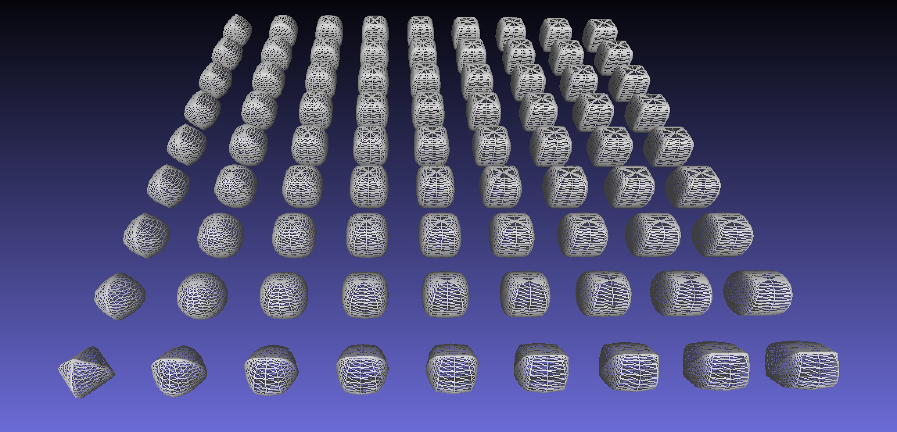
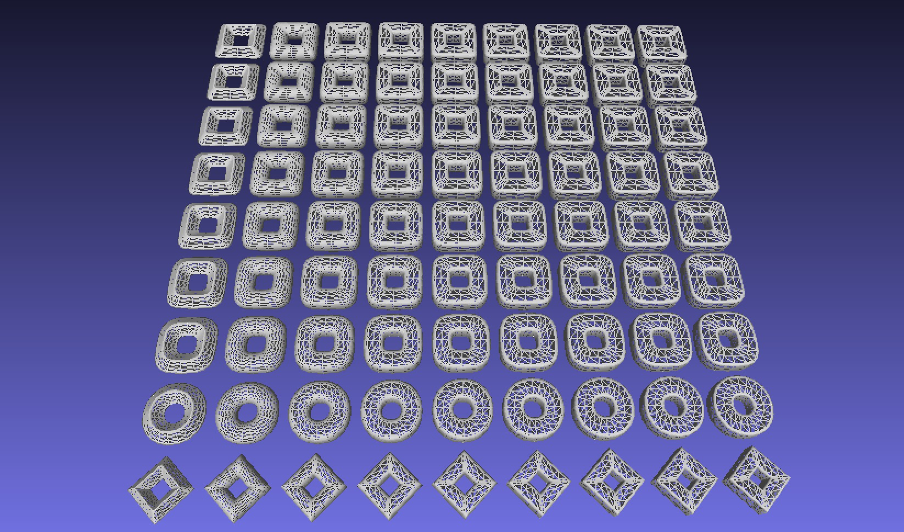

This code generates different types of superquadrics

superquadrics = superellipsoids + 
                superhyperboloids of one piece + 
                superhyperboloids of two pieces + 
                supertoroids
See Figure 2.6 https://cse.buffalo.edu/~jryde/cse673/files/superquadrics.pdf

How to run: python3 produce_array.py

Res:

